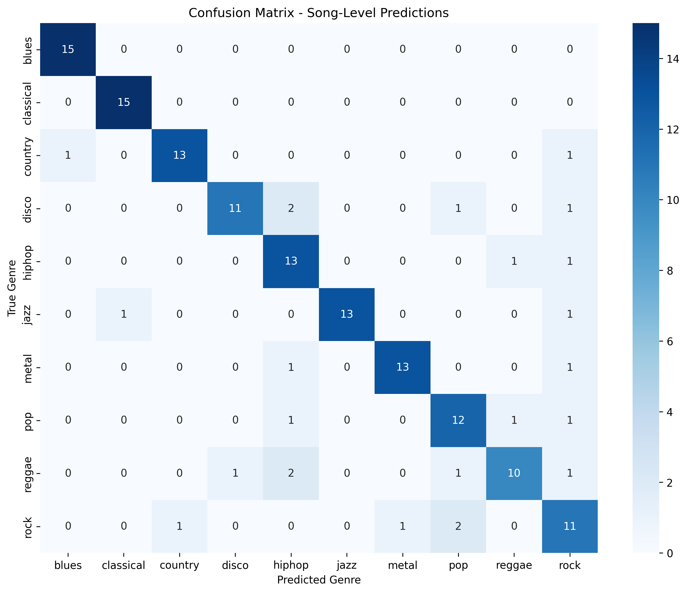
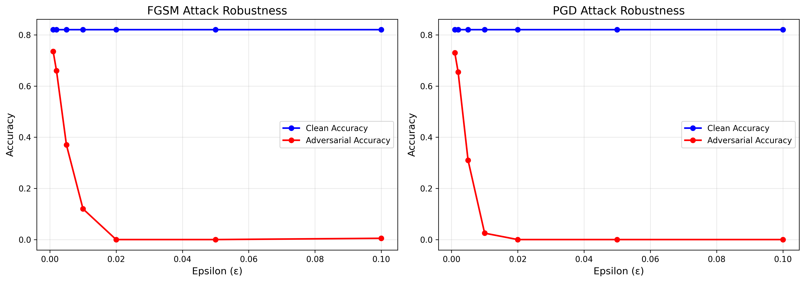
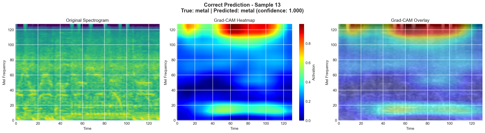
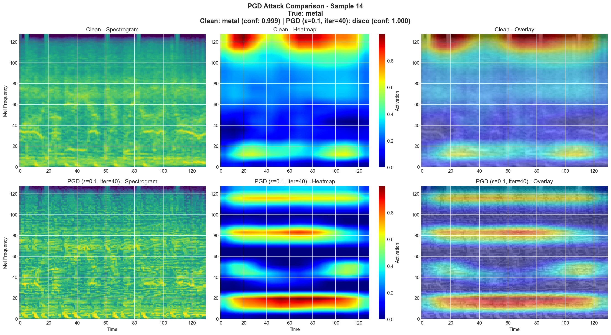

# Project Documentation

## Overview

This project explores the robustness of a Convolutional Neural Network (CNN) for music genre classification and uses Grad-CAM for explainability analysis. The goal is to understand how adversarial perturbations affect model predictions and which spectrogram regions influence the decision-making process.

## Project Structure

```
xai-music-genre-robustness/
├── data/                       # Dataset storage
│   ├── raw/                    # Original GTZAN dataset
│   └── processed/              # Preprocessed spectrograms and splits
├── docs/                       # Documentation files
├── notebooks/                  # Jupyter notebooks for analysis
├── results/                    # Training results and visualizations
│   ├── figures/                # Generated plots and Grad-CAM heatmaps
│   ├── metrics/                # Performance metrics (JSON)
│   └── models/                 # Saved model checkpoints
├── src/                        # Source code modules
│   ├── attacks/                # Adversarial attack implementations
│   ├── data/                   # Data loading and preprocessing
│   ├── explainability/         # Grad-CAM implementation
│   └── models/                 # CNN architecture and training
└── requirements*.txt           # Python dependencies
```

## Dataset

**Name:** GTZAN Music Genre Classification  
**Source:** [Kaggle](https://www.kaggle.com/datasets/andradaolteanu/gtzan-dataset-music-genre-classification/data)

### Genres (10 classes)
blues, classical, country, disco, hiphop, jazz, metal, pop, reggae, rock

### Dataset Statistics
- **Total tracks:** 1000 (100 per genre)
- **Audio format:** 30-second clips at 22050 Hz
- **Training set:** 699 tracks (6983 segments) as 1 track is faulty
- **Validation set:** 150 tracks (1498 segments)
- **Test set:** 150 tracks (1500 segments)

### Preprocessing
- Audio segmentation: 3-second clips (10 per track)
- Mel spectrogram extraction: 128 mel bands × 130 time frames
- Normalization: Per-spectrogram standardization

## Model Architecture

**Model:** GenreClassifierCNN (PyTorch)  
**Total Parameters:** 1,440,618 (all trainable)

### Architecture Details
```
Input: (128, 130, 1) - Mel spectrogram

Block 1: Conv2d(32) → BatchNorm → Conv2d(32) → BatchNorm → MaxPool → Dropout(0.15)
Block 2: Conv2d(64) → BatchNorm → Conv2d(64) → BatchNorm → MaxPool → Dropout(0.15)
Block 3: Conv2d(128) → BatchNorm → Conv2d(128) → BatchNorm → MaxPool → Dropout(0.15)
Block 4: Conv2d(256) → BatchNorm → Conv2d(256) → BatchNorm → MaxPool → Dropout(0.15)

Flatten → Dense(512) → Dropout(0.5) → Dense(10)
```

### Training Configuration
- **Epochs:** 50 (with early stopping, patience=10)
- **Batch size:** 64
- **Learning rate:** 0.0005 (with ReduceLROnPlateau scheduler)
- **Optimizer:** Adam (weight decay=0.0001)
- **Loss function:** CrossEntropyLoss

### Performance
- **Test accuracy (clip-level):** 78.47%
- **Test accuracy (song-level):** 84.00%
- **Test loss:** 0.755

## Adversarial Robustness

Two adversarial attack methods were implemented using the Adversarial Robustness Toolbox (ART):

### 1. FGSM (Fast Gradient Sign Method)
Single-step attack using gradient sign to generate perturbations.

### 2. PGD (Projected Gradient Descent)
Multi-step iterative attack (10 iterations) for stronger perturbations.

### Attack Results (200 test samples, clean accuracy: 82%)

| Epsilon | FGSM Accuracy | PGD Accuracy | FGSM Attack Success | PGD Attack Success |
|---------|---------------|--------------|---------------------|-------------------|
| 0.001   | 73.5%         | 73.0%        | 10.4%              | 11.0%             |
| 0.002   | 66.0%         | 65.5%        | 19.5%              | 20.1%             |
| 0.005   | 37.0%         | 31.0%        | 54.9%              | 62.2%             |
| 0.01    | 12.0%         | 2.5%         | 85.4%              | 97.0%             |
| 0.02    | 0.0%          | 0.0%         | 100.0%             | 100.0%            |

**Key Finding:** Model is highly vulnerable to adversarial perturbations, especially at ε ≥ 0.01.

## Explainability with Grad-CAM

Gradient-weighted Class Activation Mapping (Grad-CAM) visualizes which spectrogram regions influence model predictions.

### Analysis Categories
1. **Baseline correct predictions** - Normal model behavior
2. **Natural failures** - Misclassifications without attacks
3. **Adversarial FGSM** - Predictions under FGSM attacks
4. **Adversarial PGD** - Predictions under PGD attacks

### Visualization
Heatmaps overlay on spectrograms show:
- **Red regions:** High importance for prediction
- **Blue regions:** Low importance for prediction

Results are saved locally in `results/figures/gradcam/` (note: this directory is excluded from version control; representative examples are available in `docs/figures/`)

## Methodology

The analysis follows a systematic pipeline across five Jupyter notebooks:

### Notebook 1: Data Exploration
- Load GTZAN dataset (1000 tracks, 10 genres)
- Visualize genre distribution and sample spectrograms
- Identify faulty track (jazz.00054.wav) and exclude it

### Notebook 2: Preprocessing
- Split data: 70% train / 15% validation / 15% test (at track level)
- Segment each 30-second audio into 10 × 3-second clips
- Convert to mel spectrograms (128 mel bands × 130 time frames)
- Apply per-spectrogram standardization
- Save processed data with metadata (9,981 total segments)

### Notebook 3: Model Training
- Build CNN with 4 convolutional blocks (32→64→128→256 channels)
- Train with Adam optimizer (lr=0.0005, batch_size=64)
- Apply early stopping (patience=10) and learning rate scheduling
- Evaluate on test set: 78.47% clip-level, 84% song-level accuracy
- Generate confusion matrix and training curves
- Save best model checkpoint

### Notebook 4: Adversarial Attacks
- Load trained model and prepare ART classifier wrapper
- Generate FGSM attacks (single-step gradient sign method)
- Generate PGD attacks (40 iterations, stronger optimization)
- Test across epsilon values: 0.001, 0.002, 0.005, 0.01, 0.02, 0.05, 0.1
- Measure accuracy drop and attack success rates
- Compare FGSM vs PGD effectiveness

### Notebook 5: Grad-CAM Analysis
- Initialize Grad-CAM with last convolutional layer (conv4_2)
- **Baseline:** Generate heatmaps for 20 correctly classified samples (2 per genre)
- **Natural failures:** Analyze 5 misclassified samples with comparison to correct predictions
- **FGSM attacks:** Create side-by-side visualizations for 20 samples (ε=0.1)
- **PGD attacks:** Create side-by-side visualizations for same 20 samples (ε=0.1)
- Visualize how attention patterns shift under attacks

## Source Code Modules

### `src/models/`
- `cnn.py` - CNN architecture definition
- `trainer.py` - Training loop and evaluation utilities

### `src/data/`
- `preprocessor.py` - Audio preprocessing and spectrogram generation
- `loader.py` - PyTorch dataset and dataloader classes

### `src/attacks/`
- `adversarial.py` - FGSM and PGD attack implementations

### `src/explainability/`
- `gradcam.py` - Grad-CAM implementation for visualization

## Usage

### 1. Preprocess Data
Run `02_preprocessing.ipynb` to convert audio files to spectrograms.

### 2. Train Model
Run `03_model_training.ipynb` to train the CNN.

### 3. Test Robustness
Run `04_adversarial_attacks.ipynb` to evaluate adversarial robustness.

### 4. Generate Explanations
Run `05_gradcam_analysis.ipynb` to create Grad-CAM visualizations.

## Results

### Training Performance


The model converged after ~30 epochs with clear learning progression. Final performance: **78.47% clip-level accuracy** and **84% song-level accuracy**. The higher song-level accuracy indicates consistent predictions across segments of the same track.

### Confusion Matrix



**Performance by Genre:**
- **Perfect (100%):** Blues, Classical - unique spectral signatures
- **Strong (86.7%):** Hip-hop, Country, Jazz, Metal - minimal confusion
- **Good (73-80%):** Pop, Disco, Rock - confused with similar genres
- **Challenging (66.7%):** Reggae - main confusion with hip-hop

Main confusion source: genres with similar rhythmic patterns (disco ↔ hip-hop, reggae ↔ hip-hop, pop ↔ rock).

### Adversarial Robustness



Model shows **high vulnerability** to adversarial attacks. Critical threshold at ε=0.01 where accuracy drops below 12%. PGD consistently outperforms FGSM due to iterative optimization. At ε≥0.02, both attacks achieve ~100% success rate.

### Adversarial Perturbations Visualization


Visual comparison of original spectrogram (classical, correctly predicted) versus FGSM and PGD adversarial versions. Both attacks cause misclassification (jazz, blues) despite perturbations being barely visible. The perturbation heatmaps show noise patterns added by each attack method.

### Grad-CAM Explainability



Grad-CAM heatmaps reveal which frequency-time regions the model focuses on. For metal (shown above), the model attends to high-frequency regions (>100 Hz) with sustained energy patterns - musically meaningful features characteristic of the genre.


Natural misclassification example: disco predicted as hip-hop. The model focuses on low-frequency bass patterns similar to hip-hop, showing how genre overlap causes confusion.



Side-by-side comparison of clean (metal, correct) vs PGD adversarial (disco, incorrect). The attack causes dramatic attention shift, creating artificial focus regions that don't correspond to real musical features. This demonstrates how adversarial perturbations fundamentally alter model perception.

**Key Findings:**
1. Model learns genre-specific attention patterns on clean data
2. Natural failures occur at legitimate genre boundaries
3. Adversarial attacks create artificial attention patterns
4. Model is highly vulnerable without adversarial training

## Dependencies

Key libraries used:
- **PyTorch** - Deep learning framework
- **librosa** - Audio processing
- **adversarial-robustness-toolbox** - Adversarial attacks
- **grad-cam** - Explainability visualization
- **scikit-learn** - Data splitting and metrics
- **matplotlib/seaborn** - Plotting

See `requirements.txt` for complete list.
